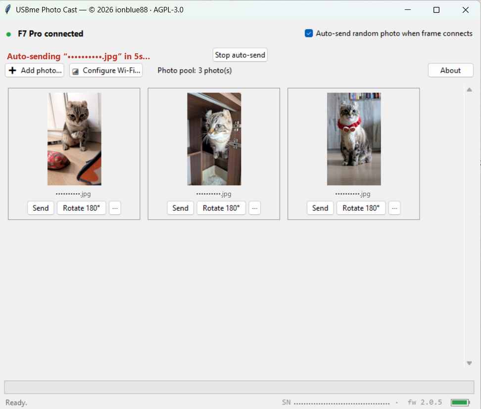
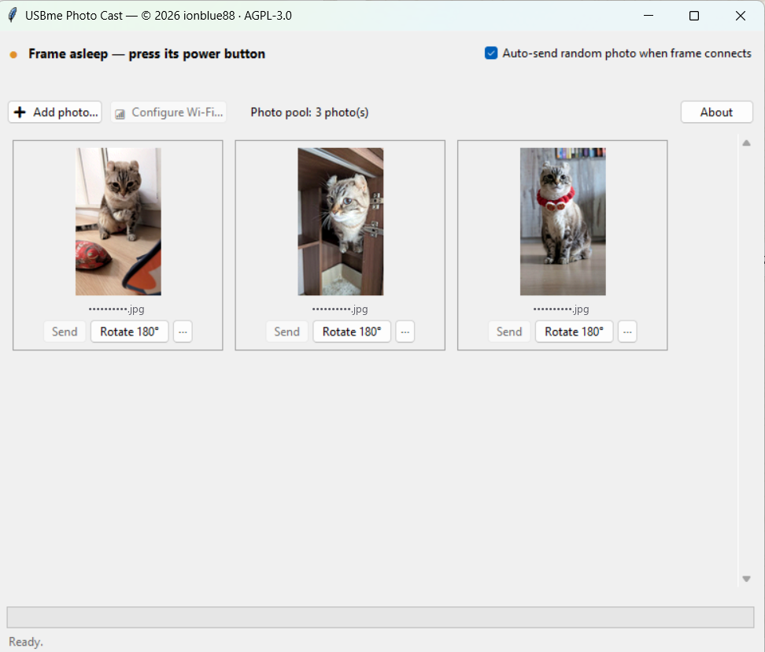

# USBme Photo Cast

A small desktop app that casts photos to a 6‑colour e‑ink photo frame **over USB** —
no cloud account, no companion app, no internet required. Pick a photo, crop it to the
frame's panel, and send it straight down the cable.

The app encodes each image into the frame's native 6‑colour e‑ink format and streams it
over the frame's USB serial link. Everything stays on your machine.



## Features

- **Crop‑to‑fit editor** — an aspect‑locked crop box with a **live 6‑colour e‑ink preview**
  beside it. Choose which frame to crop for (**Crop for:** F7 / F7 Pro / F13 / F8), rotate,
  and toggle **Optimise for e‑ink** (boosts colour and contrast so photos don't look flat).
  Optionally **store the original** full‑resolution photo instead of a space‑saving copy.
- **Photo pool** — keep a library of prepared photos as thumbnails, each with **Send** and a
  **⋯** menu (**Crop…**, **Delete**). One photo can hold a **separate crop per frame** — so
  the same photo sends correctly to an F7 Pro *and* an F13 without re‑cropping each time; if
  you send to a frame it hasn't been cropped for, the crop editor opens for that frame first.
  The grid reflows as you widen the window.
- **Auto‑send on connect** — optionally push a random photo from the pool every time you
  plug the frame in, with a 5‑second countdown and a **Stop** button so you can cancel.
  The setting is remembered between runs.
- **Wi‑Fi setup over USB** — send your home Wi‑Fi credentials to the frame through the
  cable.
- **Live status bar** — a green dot when a frame is connected, the detected model, its
  serial number and firmware, and a battery indicator.
- **Multiple panels** — the resolution is detected automatically from the connected
  frame (see below).

When the frame is plugged in but asleep, the status says so and the frame‑only actions
(**Send** and **Configure Wi‑Fi**) stay greyed out until you wake it:



## Supported frames

The panel size is read from the frame's serial‑number prefix:

| Model  | Panel (W×H) |
|--------|-------------|
| F7 Pro | 1024 × 600  |
| F7     | 800 × 480   |
| F13    | 1200 × 1600 |
| F8     | 1200 × 1600 |

Any 6‑colour e‑ink frame that enumerates as a CH340 USB‑serial device and speaks the
same protocol should work. Only the **F7 Pro** has been tested on real hardware; the
other resolutions are wired up but unverified.

## Requirements

- **Python 3.9+** with Tkinter (bundled with the standard Python installer on Windows and
  macOS; on Linux install e.g. `python3-tk`).
- **Pillow** and **pyserial** (see [`requirements.txt`](requirements.txt)).
- Optional extras for more input formats / speed: `numpy`, `pillow-heif` (HEIC/HEIF),
  `pillow-avif-plugin` (AVIF).
- A USB cable. On **Windows** the frame needs the **CH340** driver (Windows Update usually
  installs it automatically the first time you plug it in).

## Install

```bash
git clone https://github.com/ionblue88/usbme-photo-cast.git
cd usbme-photo-cast
pip install -r requirements.txt
```

To enable the optional extras, uncomment them in `requirements.txt` (or install directly):

```bash
pip install numpy pillow-heif pillow-avif-plugin
```

## Usage

```bash
python usbme_photo_cast.py
```

On Windows, launch with `pythonw usbme_photo_cast.py` to run without a console window.

Then:

1. **Plug in the frame** over USB and **wake it** with its power button — it must be awake
   to answer over serial. When it connects, the status dot turns green and shows the model.
2. **Add photo…** → choose an image → crop/rotate it to fill the panel → **Add to pool**
   (or send it right away).
3. Click **Send** under any thumbnail to display it now. The panel erases (a few seconds)
   and then refreshes with your photo.
4. Optionally tick **Auto‑send random photo when frame connects** to have a pooled photo
   pushed automatically on each connect.

### Configure Wi‑Fi (optional)

**Configure Wi‑Fi…** sends your home network's SSID and password to the frame over the
USB link, so the frame can join your network for its own built‑in online features. This is
independent of the USB photo transfer above — you don't need Wi‑Fi to send photos.

## How it works

Photos are dithered to the frame's 6‑colour palette, packed to 4 bits per pixel, and
streamed in 1024‑byte chunks over a 115200‑baud serial link, with the frame acknowledging
each step. The full wire protocol — framing, opcodes, the transfer handshake, and the
image encoding — is documented in **[PROTOCOL.md](PROTOCOL.md)**.

## Data & privacy

The app is fully local. Prepared photos and settings live in a `USBmePhotoCast` folder in your
home directory (`~/USBmePhotoCast`): the encoded images in `pool/`, their metadata in
`pool.json`, and your preferences in `settings.json`. Nothing is uploaded anywhere by this
tool.

## Troubleshooting

- **Status shows "Frame asleep."** The cable is detected but the frame isn't answering —
  press its power button to wake it. The dot turns green and the model appears once it
  responds, and auto-send waits for that (it won't fire into a sleeping frame).
- **Status stays "Not connected."** No frame is detected on USB at all. On Windows, confirm
  the CH340 driver is installed and the frame shows up as a COM port, and check the cable.
- **A send fails or the header is rejected.** This usually means an image size / panel
  mismatch. The app encodes to the detected model's resolution automatically; if you
  swapped frames, reconnect so the model is re‑detected.
- **A photo won't open.** Install the optional `pillow-heif` / `pillow-avif-plugin` extras
  for HEIC/AVIF files.

## Disclaimer

This is an independent, unofficial tool, not affiliated with or endorsed by the frame's
manufacturer. The USB protocol was determined by observation and may differ across
firmware versions. Use at your own risk.

## License

Copyright (C) 2026 ionblue88. Licensed under the **GNU Affero General Public License
v3.0** ([AGPL-3.0](LICENSE)). You're free to use, modify, and share it — but any
distributed or network‑hosted derivative must also be released as open source under
the AGPL, with the copyright and author notices preserved. See [LICENSE](LICENSE) and
[NOTICE](NOTICE).
